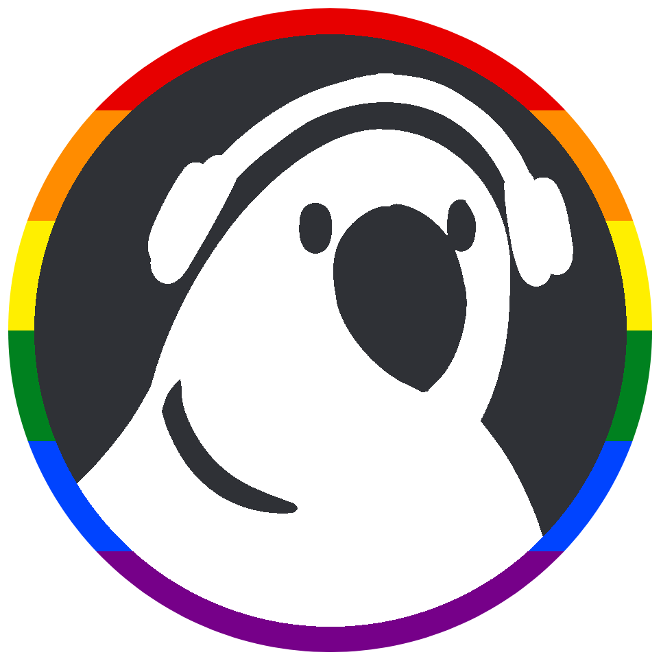

  

<h1 align="center" style="margin-top: 0px;">peiarrot</h1>

A <a href="https://discord.com">Discord</a> bot for International Afterparty (EIA), built using <a href="https://github.com/discordjs/discord.js">discord.js</a>

    
    

